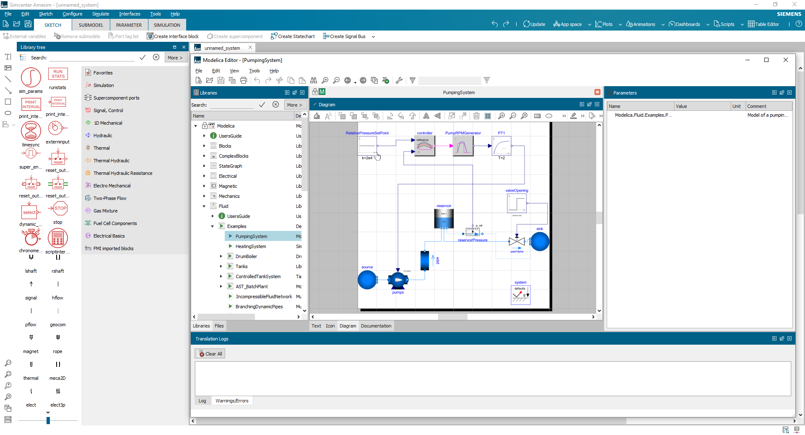

# Modelica libraries for Simcenter Amesim

This page lists all Modelica libraries compatible with **Simcenter Amesim** that can be edited from **Modelica Editor**. More than a tool to be used during the design and modeling phase of a Modelica model, **Modelica Editor** allows you to generate bridges between the acausal world of Modelica and the causal environment of **Simcenter Amesim**.

## Open-Source Modelica libraries

All listed libraries below have been forked in github and reworked to be compatible with **Simcenter Amesim**.

|Library name|Description|Release|Zip file|MSL version|
|---|---|---|---|---|
|Buildings|Buildings library|[9.0.0](https://github.com/karimbesbes/modelica-buildings)|[here](https://github.com/karimbesbes/modelica-buildings/archive/refs/heads/master.zip)|4.0.0|
|TRAMI-L3 (AT)|TRAMI Layer 3 for AT|[2021-03](https://github.com/karimbesbes/TRAMI_L3-AT)|[here](https://github.com/karimbesbes/TRAMI_L3-AT/archive/refs/heads/main.zip)|3.2.3|
|PowerSystems|Electrical Power Systems library|[1.0.1](https://github.com/karimbesbes/PowerSystems)|[here](https://github.com/karimbesbes/PowerSystems/archive/refs/heads/master.zip)|3.2.3|